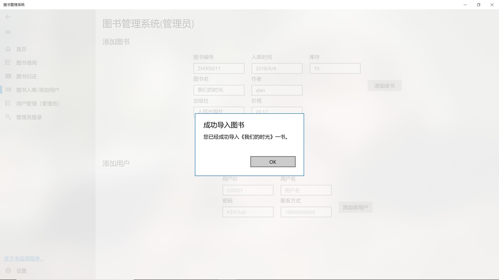

#实验 5 数据库程序设计

| 姓名   | 学号 | 指导老师 | 日期      |
| ------ | ---- | -------- | --------- |
| 肖振新 | *    | 高云君   | 2018.6.10 |

##一、实验目的

1、 设计并实现一个精简的图书管理系统，具有入库、查询、借书、还书、借书证管理 等基本功能。

2、 通过本次设计来加深对数据库的了解和使用，同时提高自身的系统编程能力。 

##二、实验平台开发工具:

MySQL、Visual Studio 2017 、UWP、Pyhton、C#、Xaml、telerik UI for ASP.NET

Jetbrains DataGrip、Debian Linux OS 9(MySQL server)、MySQL Plugin For .NET framework

## 三、总体设计

### 系统架构概述

本程序是在Windows平台下开发的简易图书管理系统，我也不太擅长花很多时间在写长篇大论的报告上，所以本报告也会写的比较简洁，主要以贴图为主。。

前端采用Windows UWP开发包进行设计，主窗口采用了Windows 2017 fall creator update（Windows秋季创意者更新）中新引入的navigation bar控件进行导航，这也是Windows内置应用（如设置）和众多Windows应用商店所采用的窗口导航方案，总体背景使用了transparent的透明亚克力，使得程序使用更加流畅。安装卸载都如同Windows应用商店的程序那样便捷。数据表的展示使用了telerik UI for ASP.NET，数据展示十分自然完整。

本程序使用了大量的异步编程方案，使得在执行存取数据等与后端数据库交互的耗时操作时程序不至于无响应。

本程序后端提供了以下三种解决方案：（值得一提的是，不管使用哪一种方案，用户的操作逻辑是完全相同的，只需要在第一次打开本程序时在设置中初始化即可，之后配置就会被保存在Windows系统管理的缓存中，这也符合了前后端逻辑分离的原则）

1. 使用本地的MySQL数据库服务器，这需要在本地电脑安装MySQL服务器。
2. 使用云端的测试服务器，此服务器是作者自行租用的服务器，为了让没有下载MySQL数据库的用户也可以使用，缺点是延迟较高。
3. 使用MiniSQL数据库引擎，这是为期末大程设计的数据库，正好集成到了此图书管理系统应用中，作为数据库后端引擎，是本程序的一大亮点。该数据库引擎随程序一起打包发布，无需另外下载。

###数据库表设计

- 图书信息表(books) 

  | 字段名    | 类型     | 含义               |
  | --------- | -------- | ------------------ |
  | BookNo    | char(20) | 图书编号，**主码** |
  | BookName  | char(20) | 图书名             |
  | Publisher | char(20) | 出版商             |
  | Date      | char(20) | 入库时间           |
  | Author    | char(20) | 作者               |
  | Price     | char(20) | 价格               |
  | Storage   | char(20) | 库存量             |

- 图书借阅信息表（records）

  | 字段名                 | 类型     | 含义                            |
  | ---------------------- | -------- | ------------------------------- |
  | UserID                 | char(20) | 用户名，**来自user表的外键**    |
  | BookNo                 | char(20) | 图书编号，**来自books表的外键** |
  | LentDate               | char(20) | 出借日期                        |
  | ReturnDate             | char(20) | 归还日期                        |
  | Returned               | char(20) | 是否归还                        |
  | UserID,BookNo,LentDate | -        | 主码                            |

- 用户信息表（users）

  | 字段名   | 类型     | 含义             |
  | -------- | -------- | ---------------- |
  | UserID   | char(20) | 用户ID，**主码** |
  | Password | char(20) | 密码             |
  | Name     | char(20) | 用户姓名         |
  | Contact  | char(20) | 联系方式         |

### 所用开发技术

本程序的亮点是uwp窗口的设计和多种多样的后端连接方式，本作者的学习路线也是十分的陡峭，从毫无Windows开发经验到两天入门c#、xaml、uwp和win32 api那一套，然后动手写该程序。由于c#远不是我最为拿手的语言，写起来也很不顺手。之前在用傻瓜式的qt做图形界面开发时，并不需要考虑什么异步操作、多线程操作，但是因为图书管理系统在取数据的时候可能很慢（比如大规模的图书数据、或者连接远程服务器时的巨大延迟），为了不使程序在这个过程中无反应（没错就是大家经常看到的此程序“未响应”然后过一会又好了），就必须采用异步编程。最后整个程序使用起来也是十分的流畅。

navigation bar和透明毛玻璃效果时也是微软对新的UI布局方案一次尝试，笔者注意到，在最新的WWDC 2018苹果全球开发者大会上，新版本的macOS mojave的一些内置程序如“新闻、应用商店”等也采用了类似于Windows uwp的窗口布局方案，这也与本程序的高度一致。如下图所示：

当然，作为一个数据库作业，最为重要的还是后端数据库逻辑的设计，本实验和数据库理论联系最为密切的应该就是于后端数据库的连接和数据表data schema的设计了。本程序连接后端或者云端的mysql数据库使用的是c#版本的mysql connector，由mysql官方发布，专门为Microsoft .NET framwork框架开发，相应的visual studio集成驱动的下载官网链接为https://dev.mysql.com/downloads/connector/net/，如下图所示：

数据表的内容在前面也已经列表说明了，主要就是三个数据表，books表存的就是图书的信息，包括图书编号、图书名等等关于本图书的各种信息，在用户登录的情况下可以进行借书操作。users表存的是用户的信息，包括用户账号密码、姓名和联系方式，user表在**管理员账号**下可以进行修改，然后新的用户可以登录借书。连接这两个表的就是借书记录了，借书记录主要包含了借的人的编号，图书编号和出借/归还日期，注意这里的主码是（图书编号+用户编号+出借日期），因为同一本书的库存可能不止一本，用户也可能借很多本这个书（尽管不大可能）。

### 代码一览

代码在这里贴个大概看一下，在报告中附上太多的代码影响美观，就不贴了。

前端代码使用xaml设计：

后端逻辑当然使用微软亲生的c#了：

another：

##四、详细设计

### 1· 主界面设计

主界面的数据表的展示使用了telerik UI for ASP.NET的一个控件，就是下图中的图书显示模块。该空间十分自然的以列表方式展示了数据。

右上角有两个按钮，刷新按钮在按下后会重新连接数据库并取回新的数据，用户登录按钮按下后会弹出新的窗口，并提示进行用户的登录。登录后可以进行借书操作。

点击右上角的用户登录，弹出新的窗口，如果输入账号或者密码错误，则会提示，登录不成功。如下图所示：

### 2· 图书借阅模块

在上方的搜索栏输入对应的信息进行搜索，下面会自动弹出满足条件的图书，选中、点击借阅即可。

如果没有登录，或者没有选中该图书、该书库存不足，则会报错，借阅不成功：

如果借阅成功，一条新的记录会被导入到record表中，**并且该书库存减1**.

### 3· 图书归还模块

好了，现在在上一步骤中借到书已经添加到records中了，我们到图书归还模块中去查看（这是归还完成时的界面）：

我们可以点击归还该书：

### 4· 图书入库/添加用户模块

在这里，只有登录了管理员才可以进行操作，如果登录了管理员，**那么左上角会显示管理员字样**

如果没有登录管理员，则不具有管理员权限，那么在试图操作时会报错：

我们现在登录管理员账号，导入新图书：

然后顺便尝试一下添加新用户：

### 5· 用户管理模块

好了，在上一步骤中添加的新用户，可以在用户管理界面进行查看和删除了，同样，如果没有登录管理员，那么跳转到这个界面的时候什么也看不到～

然后我们选择一个用户，删除掉它：

这时候，我们可以看到，这个用户已经人间蒸发了：

### 6·管理员/用户登录模块

这里是管理员登录弹窗，注意的是和在主界面的用户登录界面基本相似，但是职能不同。只有在这里登录了，才可以进行上面的图书入库/用户添加删除操作。

### 7· 设置模块

设置模块在第一次启动本程序的时候会自动跳转到这里，并且如果没有在这里选择一个数据库源的话，即使点击左侧栏目的其他窗口，也会弹窗报错，提示无法连接数据库。在第一次打开本程序并选择一个方式初始化数据库后，该信息会保存在windows缓存中，接下来打开本程序都不需要再次设置，并且会自动跳转到首页作为默认的界面。

如果选择本地连接，且之前已经创建好了一个数据库，那么惦记连接到现有的数据库，否则，点击新建一个数据库：

如果希望连接到一个远程的数据库，那么点击下面的连接到云端数据库（注意：由于网络延迟，服务器在国外（你懂的），所以每次交互需要的时间可能较长，在我的电脑上实际测试，每个操作大概都有一秒左右的延迟）：

同理，也可以连接到程序自带的minisql数据库。