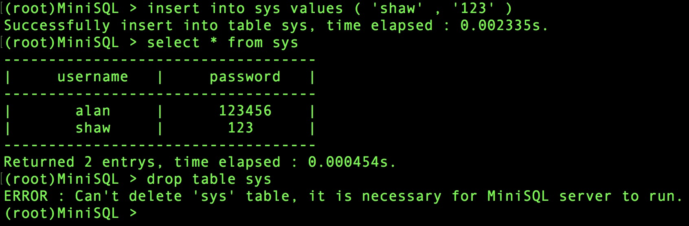

# MiniSQL 设计报告

| 作者   | 学号 | 课程       | 专业                                        |
| ------ | ---- | ---------- | ------------------------------------------- |
| 肖振新 | *    | 数据库系统 | 竺可桢学院交叉创新平台（计算机+自动化控制） |

### 程序运行截图


## 目录：

[TOC]


## 概论

本MiniSQL数据库是仿照MySQL数据库交互界面开发的简易数据库引擎，支持查找、插入、删除等数据库的基本操作。设计过程全部由一人完成，所以没有具体的分工。开发语言采用python 3.7，并进行打包成无需额外依赖的二进制可执行程序，在Windows、macOS和Linux平台下均可运行。

本项目的GitHub地址：https://github.com/AlanShaw-GitHub/MiniSQL

功能/亮点：

1. 程序添加了登录模块，分为root管理员和普通用户两种，root可以**添加删除用户**（通过root权限的sys（username，password）表）。
2. 程序交互界面高度贴近MySQL和大多数Linux终端交互逻辑，**按键盘的“上”、“下”键可以定位到上、下一条语句**，十分方便。
3. 程序使用“lasy”的修改方式，即为了减少频繁写入磁盘的用时，所有的更改都暂时保存在内存中，不会写到本地文件，在键入“quit”命令退出本程序时，所有的更改才会被写入文件。任何非正常的退出都会导致此次所有更改的丢失，如果希望立即写入文件，**请敲入“commit”命令**，则所有的更改都会被立即写入文件。
4. **B+树索引**，在查找时优先检测是否存在在主码上的条件查询，如果没有，再检测是否存在在索引上的条件查询，然后其他。所以大部分查询时间复杂度都在log级别。详细的设计将会在后面一一介绍。
5. 类型char（N)中的**N没有大小限制**，多大都可以。同样，一个表也可以定义**无数个**属性，没任何限制。
6. 支持从文件中读取批量命令并执行，命令之间用分号分隔，**支持注释**（以#开头的行会被当作注释而不会被执行）
7. 提供基本的帮助文档，键入help或者？即可以查看支持的命令，键入“help 【命令】”即可以查看对应命令的帮助文档。
8. buffer manager采用**嵌套式json文件**存储，b+树有多高就有几层json嵌套。方便而又高效地完整保存了整个B+树的结构，详细设计会在后面介绍。
9. 较为完善的错误提示机制，使用了大量的检测点以及完整的错误捕捉机制，程序因此不会因为各种异常而退出。大量常见的语法错误都会检测到并且在终端中输出提示，告知用户语法错误的地方。
10. 简洁而不简单：本程序总代码只有一千多行，但是涵盖了所有数据库所必需的组件，尽可能的精简代码和提高操作效率，是本程序在设计时的首要目标。**每个操作的用时也都会随着结果一起打印出来**，供用户分析。

## 第一章 MiniSQL总体框架

### 第1.1节 MiniSQL实现功能分析

1. 总功能:允许用户通过字符界面输入 SQL 语句实现表的建立/删除;索引的建立/删除以及表记录的插入/删除/查找;
2. 数据类型:支持三种基本数据类型:INT，CHAR(N)，FLOAT，**其中 CHAR(N)中的 N 没有大小限制**，多大都行。
3. 表定义:一个表最多可以定义**无数个**属性，各属性可以指定是否为 UNIQUE;支持单属性的 主键定义;
4. 索引的建立和删除:对于表的主属性自动建立B+树索引，对于声明为 UNIQUE 的属性可以 通过 SQL 语句由用户指定建立/删除 B+树索引(因此，所有的 B+树索引都是单属性单值的); 
5. 查找记录:可以通过指定用 AND 连接的多个条件进行查询，支持**等值/不等值**查询和区间查询; 
6. 插入和删除记录:支持每次一条记录的插入操作;支持每次一条或多条记录的删除操作。 

### 第1.2节 MiniSQL系统体系结构

系统体系结构如下图所示，和设计报告模版中的略有不同，我将record manager整合到了catalog和index manager中。


### 第1.3节 MiniSQL设计语言和运行环境

设计语言：python 3.7

开发环境：macOS 10.14 Jetbrains PyCharm 2018.1

## 第二章 MiniSQL各模块实现的功能/接口

### 第2.1节 概论

### 第2.2节 Interpreter 实现功能/接口

##### Interpreter 模块直接与用户交互，主要实现以下功能:

1. 登录模块的基本接口，如果是管理员账户（默认账号root密码123456）登录则具有管理员权限，可以添加删除用户（在 API 层完成）。
2. 程序流程控制，即“启动并初始化、接收命令、处理命令、显示命令结果、循环、退出”流程。 
3. 接收并解释用户输入的命令，生成命令的内部数据结构表示，调用 API 层提供的函数执行并显示执行结果。（错误语法处理在 API 层实现，Interpreter 模块只负责捕捉错误并提示在窗口。
4. 帮助信息的实现也在这个部分完成，用户可以在终端键入“help 【命令名】”来查看对应的帮助文档。
5. 对从文件加载批量命令的支持，其实就是从文件中读取命令，然后调用API层的函数来一句句解析这些语句，以#开头的行会被当作注释而不会被执行。

##### Interpreter 模块的接口

Interpreter 模块主要是调用其他模块的接口，自己没有提供接口给其他模块。

### 第2.3节 API 实现功能/接口

API 模块是整个系统的核心，其主要功能为提供执行 SQL 语句的接口，供 Interpreter 层调用。该接口以 Interpreter 层解释生成的命令内部表示为输入，根据 Catalog Manager 提供的信息确定执行规则，并调用 Record Manager、Index Manager 和 Catalog Manager 提供的相应接口进行执行，最后返回执行结果给 Interpreter 模块。 

API 模块主要是在做语法解析工作，并且也会调用其他模块来进行错误处理。

##### 主要实现功能：

主要就是对insert、select、delete、create、drop五个指令进行语法解析和错误处理，并调用 Record Manager、Index Manager 和 Catalog Manager 提供的接口实现数据库的更改操作

##### 模块接口

提供以下五个函数，全部为顶层的Interpreter 模块服务，执行五种不同的操作：

1. select：顾名思义。
2. insert：顾名思义。
3. delete：顾名思义。
4. create：顾名思义。
5. drop：顾名思义。


### 第2.4节 Catalog Manager 实现功能/接口

##### 实现功能

Catalog Manager 负责管理数据库的所有模式信息，包括: 

1. 数据库中所有表的定义信息，包括表的名称、表中字段(列)数、主键、定义在该 表上的索引。 
2. 表中每个字段的定义信息，包括字段类型、是否唯一等。 
3. 数据库中所有索引的定义，包括所属表、索引建立在那个字段上等。 

Catalog Manager 还必需提供访问及操作上述信息的接口，供 Interpreter 和 API 模块使用。 

##### 模块接口

1. create_table：创建表的定义。

2. check_types_of_table：被Interpreter 模块调用，如果不满足则抛出一个异常。在insert一个记录时，该函数帮助检查values的值是否满足要求，比如values的数量和列数量是否相同、unique的值是否有重复（调用record manager检测）、char的宽度是否满足条件（小于N）。

3. exists_table：如果table已经存在，就产生一个异常，被Interpreter 模块在创建一个表的时候预先调用做检查。

4. not_exists_table：如果一个表不存在，就产生一个异常，被Interpreter 模块在删除一个表的时候预先调用做检查。

5. not_exists_index：如上同理。

6. exists_index：如上同理。

7. drop_table：删除一个表。

8. drop_index：删除一个索引。

9. create_index：创建一个索引。

10.  check_select_statement：检查选择语句的正确性，被Interpreter 模块调用，如果不满足则抛出一个异常。在Interpreter 模块调用select相关操作之前做错误检查，主要检查选择的columns是否在表中有这些列，where语句提到的这些列是否存在、类型是否满足等等。


### 第2.5节 Record/Index Manager 实现功能/接口

##### 实现功能

Index Manager负责 B+树索引的实现，实现B+树的创建和删除(由索引的定义与删除引起)、等值查找、插入键值、删除键值等操作，并对外提供相应的接口。 B+树中节点大小应与缓冲区的块大小相同，B+树的叉数由节点大小与索引键大小计算得到。 

##### 模块接口

1. insert_into_table：将一个列插入b+树。

2. delete_from_table：将一个或多个列从b+树中删除，根据where语句。

3. select_from_table：从表中选择，并负责格式化输出，根据where语句。

4. create_table：创建一个空的b+树。

5. delete_table：删除一个表。

6. create_index：创建一个索引。

7. check_unique：检查该列的某个值是否已经在b+树中，是为Catalog Manager模块的check_types_of_table提供错误检查。

8. exist_user：检查sys系统表中是否存在该用户和正确的密码，为顶层interpreter模块服务，做用户登录模块。

    

### 第2.6节 Buffer/DB Files Manager 实现功能/接口

事实上，在设计时，buffer manager的设计内容都是集成在record和catalog代码中的，record和catalog代码直接实现了 __store__ 和 __load__ 函数，进行数据与磁盘之间的交互。

##### 实现功能

Buffer Manager 负责缓冲区的管理，主要功能有: 

1. 根据需要，读取指定的数据到系统缓冲区或将缓冲区中的数据写出到文件 
2. 实现缓冲区的替换算法，当缓冲区满时选择合适的页进行替换 
3. 记录缓冲区中各页的状态，如是否被修改过等 
4. 提供缓冲区页的 pin 功能，及锁定缓冲区的页，不允许替换出去为提高磁盘 I/O 操作的效率，缓冲区与文件系统交互的单位是块，块的大小应为文件系统与磁盘交互单位的整数倍，一般可定为 4KB 或 8KB。 

DB Files 指构成数据库的所有数据文件，主要由记录数据文件、索引数据文件和Catalog 数据文件组成。同时还有写回文件和读取文件的功能 。

##### 模块接口

###### catalog部分存取

catalog存取表、索引的信息，比如表名、列名、是否unique、主码等等信息，这部分的信息比较容易存取，提供以下函数：

1. __store__：存catalog信息。
2. __load__：从文件中取catalog信息。

###### index部分存取

index存取b+树结构，这部分是比较难存取的，主要是树结构的复杂性和各种指针的问题，使得存取树时要格外小心。

1. __store__：存b+树信息。

2. __load__：取b+树信息。

   

## 第三章 MiniSQL各模块设计详解

### 第3.1节 概论

### 第3.2节 Interpreter设计详解

这个模块主要是调用了python的cmd模块，实现不间断的轮询用户输入并调用底层api进行处理。同时，还提供了用户登录模块、从文件中执行等模块。

加载和保存，其实调用底层api，传入当前路径。自己什么也没干：

```python
def __initialize__():
    CatalogManager.catalog.__initialize__(os.getcwd())
    IndexManager.index.__initialize__(os.getcwd())

def __finalize__():
    CatalogManager.catalog.__finalize__()
    IndexManager.index.__finalize__()
```

从文件中执行，代码如下，先打开文件，然后用分号分隔命令，去掉以#开头的注释字段，然后一个个调用底层函数进行处理，最后提交修改到底层文件。：

```python
def exec_from_file(filename):
    f = open(filename)
    text = f.read()
    f.close()
    comands = text.split(';')
    comands = [i.strip().replace('\n','') for i in comands]
    __initialize__()
    for comand in comands:
        if comand == '':
            continue
        if comand[0] == '#':
            continue
        if comand.split(' ')[0] == 'insert':
            try:
                APIManager.api.insert(comand[6:])
            except Exception as e:
                print(str(e))
        elif comand.split(' ')[0] == 'select':
            try:
                APIManager.api.select(comand[6:])
            except Exception as e:
                print(str(e))
        elif comand.split(' ')[0] == 'delete':
            try:
                APIManager.api.delete(comand[6:])
            except Exception as e:
                print(str(e))
        elif comand.split(' ')[0] == 'drop':
            try:
                APIManager.api.drop(comand[4:])
            except Exception as e:
                print(str(e))
        elif comand.split(' ')[0] == 'create':
            try:
                APIManager.api.create(comand[6:])
            except Exception as e:
                print(str(e))
    __finalize__()
```

用户登录模块，除了管理员账号，其他的账号全部都从sys表中读取确认，使用底层的IndexManager.index.exist_user函数，并设置APIManager.api.__root标记表明当前是什么状态：

```python
if len(sys.argv) < 5:
    print('ERROR : Unsupported syntax, please login.\n',errortext)
    sys.exit()
if sys.argv[1] != '-u' or sys.argv[3] != '-p':
    print('ERROR : Unsupported syntax, please login.\n',errortext)
    sys.exit()
__initialize__()
if sys.argv[2] == 'root' and sys.argv[4] == '123456':
    APIManager.api.__root = True
elif IndexManager.index.exist_user(username=sys.argv[2],password=sys.argv[4]):
    APIManager.api.__root = False
else:
    print('Error : username or password is not correct,please '
          'check and login again.\n',errortext)
    sys.exit()
if len(sys.argv) > 5:
    if sys.argv[5] != '-execfile':
        print('ERROR : Unsupported syntax.\n',errortext)
    exec_from_file(sys.argv[6])
    sys.exit()
```

继承自cmd模块的类定义,删掉了很多代码，用（...somecode）代替：

```python
class miniSQL(cmd.Cmd):
    intro = 'Welcome to the MiniSQL database server.\nType help or ? to list commands.\n'
    def do_select(self,args):
        try:
            APIManager.api.select(args.replace(';',''))
        except Exception as e:
            print(str(e))
...somecode

    def do_commit(self,args):
        time_start = time.time()
        __finalize__()
        time_end = time.time()
        print('Modifications has been commited to local files,',end='')
        print(" time elapsed : %fs." % (time_end - time_start))

    def do_quit(self,args):
        __finalize__()
        print('Goodbye.')
        sys.exit()

    def emptyline(self):
        pass

    def default(self, line):
        print('Unrecognized command.\nNo such symbol : %s' % line)

    def help_commit(self):
        print()
        text = "To reduce file transfer's time, this SQL server is designed to "+\
        "'lasy' write changes to local files, which means it will not store changes "+\
        "until you type 'quit' to normally exit the server. if this server exit "+\
        "unnormally, all changes will be lost. If you want to write changes to "+\
        "local files immediately, please use 'commit' command.\n"
        print(text)

    def help_quit(self):
        print()
        print('Quit the program and write changes to local file.')

    def help_select(self):
        print()
        print("select * from student;")
        print("select num from student where num >= 2 and num < 10 and gender = 'male';")

...somecode
```


### 第3.3节 API设计详解

api模块主要是实现了五个函数（select、insert等），调用catalog和index的函数操作，并自己做一些语法上的错误检查，从代码中也可以看到，对于很多的格式错误，我都提供了监测点并抛出错误给顶层模块，抛出错误时，也会在最前面提示是哪个模块抛出的错误。由于篇幅有限，下面只展示两个函数的实现：

```python
def insert(args):
    time_start = time.time()
    args = re.sub(r' +', ' ', args).strip().replace('\u200b','')
    lists = args.split(' ')
    if lists[0] != 'into':
        raise Exception("API Module : Unrecoginze symbol for command 'insert',it should be 'into'.")
    table = lists[1]
    if table == 'sys' and __root  == False:
        raise Exception("ERROR : Can't modify 'sys' table, you are not root.")
    if lists[2] != 'values':
        raise Exception("API Module : Unrecoginze symbol for command 'insert',it should be 'values'.")
    value = args[re.search('\(',args).start()+1:find_last(args,')')]
    values = value.split(',')
    CatalogManager.catalog.not_exists_table(table)
    CatalogManager.catalog.check_types_of_table(table,values)
    IndexManager.index.insert_into_table(table,values)
    time_end = time.time()
    print(" time elapsed : %fs." % (time_end-time_start))

def delete(args):
    time_start = time.time()
    args = re.sub(r' +', ' ', args).strip().replace('\u200b','')
    lists = args.split(' ')
    if lists[0] != 'from':
        raise Exception("API Module : Unrecoginze symbol for command 'delete',it should be 'from'.")
    table = lists[1]
    if table == 'sys' and __root  == False:
        raise Exception("ERROR : Can't modify 'sys' table, you are not root.")
    CatalogManager.catalog.not_exists_table(table)
    if len(lists) == 2:
        IndexManager.index.delete_from_table(table,[])
    else:
        IndexManager.index.delete_from_table(table,lists[3:])
    time_end = time.time()
    print(" time elapsed : %fs." % (time_end-time_start))
```


### 第3.4节 Catalog Manager设计详解

catalog模块存取表的信息，定义的数据结构为：

```python
tables = {}
class table_instance():
    def __init__(self,table_name,primary_key = 0):
        self.table_name = table_name
        self.primary_key = primary_key
    columns =[]

class column():
    def __init__(self,column_name,is_unique,type = 'char',length = 16):
        self.column_name = column_name
        self.is_unique = is_unique
        self.type = type
        self.length = length
```

tables是所有的表的集合，是一个字典，key是表名，value是一个指向class table_instance的指针，代表了一个表实例对象。一个表中存了表名、主键的名字，以及一个列的集合。列又是个class column实例对象，他存了列名、是否unique、类型是什么以及如果是char类型的话，长度是多少。

下面简单给出一个表的创建对应的函数，其他琐碎的函数就不给出了。

```python
def create_table(table,statement):
    global tables
    primary_place = re.search('primary key *\(',statement).end()
    primary_place_end = re.search('\)',statement[primary_place:]).start()
    primary_key = statement[primary_place:][:primary_place_end].strip()
    cur_table = table_instance(table,primary_key)
    lists = statement.split(',')
    columns = []
    for cur_column_statement in lists[0:len(lists)-1]:
        cur_column_statement = cur_column_statement.strip()
        cur_lists = cur_column_statement.split(' ')
        is_unique = False
        type = 'char'
        column_name = cur_lists[0]
        if re.search('unique',concat_list(cur_lists[1:])) or column_name == primary_key:
            is_unique = True
        if re.search('char',concat_list(cur_lists[1:])):
            length_start = re.search('\(',concat_list(cur_lists[1:])).start()+1
            length_end = re.search('\)', concat_list(cur_lists[1:])).start()
            length = int(concat_list(cur_lists[1:])[length_start:length_end])

        elif re.search('int', concat_list(cur_lists[1:])):
            length = 0
            type = 'int'
        elif re.search('float', concat_list(cur_lists[1:])):
            length = 0
            type = 'float'
        else:
            raise Exception("Catalog Module : Unsupported type for %d." % column_name)
        columns.append(column(column_name,is_unique,type,length))
    cur_table.columns = columns
    seed = False
    for index,__column in enumerate(cur_table.columns):
        if __column.column_name == cur_table.primary_key:
            cur_table.primary_key = index
            seed = True
            break
    if seed == False:
        raise Exception("Catalog Module : primary_key '%s' not exists."
                        % cur_table.primary_key)

    tables[table] = cur_table
```


### 第3.5节 Record/Index Manager设计详解

这个模块是整个数据库的关键部分。这个模块主要实现了b+树的增删查找。这部分也是整个程序代码量最大的部分。

向b+树中插入的代码：（先调用了find_leaf_place找到要插入的叶节点位置，如果能插下去，那么就调用insert_into_leaf插入，完事。如果不能，就先调用insert_into_leaf插入，然后拆分，然后调用insert_into_parent递归的向父节点更新。

```python
def insert_into_table(table,__values):
    for index,col in enumerate(CatalogManager.catalog.tables[table].columns):
        if col.type == 'int':
            __values[index] = int(__values[index])
        elif col.type == 'char':
            __values[index] = __values[index].strip().replace("'",'')
        elif col.type == 'float':
            __values[index] = float(__values[index])

    cur_node = tables[table]
    __primary_key = CatalogManager.catalog.tables[table].primary_key
    # __primary_key = 0
    if len(cur_node.keys) == 0:
        # new tree
        cur_node.keys.append(__values[__primary_key])
        cur_node.pointers.append(__values)
        cur_node.pointers.append('')
        print('Successfully insert into table %s,' % table,end='')
        return

    cur_node = find_leaf_place(table,__values[__primary_key])
    if len(cur_node.keys) < N - 1:
        insert_into_leaf(cur_node,__values[__primary_key],__values)

    else:
        insert_into_leaf(cur_node,__values[__primary_key],__values)
        new_node = node(True,[],[])
        tmp_keys = cur_node.keys
        tmp_pointers = cur_node.pointers
        cur_node.keys = []
        cur_node.pointers = []
        for i in range(math.ceil(N/2)):
            cur_node.keys.append(tmp_keys.pop(0))
            cur_node.pointers.append(tmp_pointers.pop(0))
        for i in range(N - math.ceil(N/2)):
            new_node.keys.append(tmp_keys.pop(0))
            new_node.pointers.append(tmp_pointers.pop(0))
        cur_node.pointers.append(new_node)
        new_node.pointers.append(tmp_pointers.pop(0))
        insert_into_parent(table,cur_node,new_node.keys[0],new_node)

    print('Successfully insert into table %s,' % table,end='')
```

删除的代码：（删除时先拆分用and连接的复杂的条件，这部分和select做的事情相似。然后再看看这些条件里面有没有主码的条件，如果有，那么查找就可以在log时间内完成了（都是调用find_leaf_place_with_condition完成）。然后对于满足的所有条件，调用check_conditions检查所有的条件是否满足，如果满足，就删掉他们，然后调用maintain_B_plus_tree_after_delete来保持删除后的b+树结构）

```python
def delete_from_table(table,statement):
    # delete rows from table according to the statement's condition
    # usage : find_leaf_place_with_condition(table, column, value,condition)
    if len(statement) == 0:
        tables[table] = node(True,[],[],'')
        print("Successfully delete all entrys from table '%s'," % table,end='')
    else:
        columns = {}
        for index,col in enumerate(CatalogManager.catalog.tables[table].columns):
            columns[col.column_name] = index
        __primary_key = CatalogManager.catalog.tables[table].primary_key
        # __primary_key = 0
        # columns = {'num':0,'val':1}

        conditions = []
        tmp = []
        pos = 1
        for i in statement:
            if i == 'and':
                conditions.append(tmp)
                tmp = []
                pos = 1
                continue
            if pos == 1:
                tmp.append(columns[i])
            elif pos == 3:
                if CatalogManager.catalog.tables[table].columns[tmp[0]].type == 'char':
                    tmp.append(i.strip().replace("'", ''))
                elif CatalogManager.catalog.tables[table].columns[tmp[0]].type == 'int':
                    tmp.append(int(i))
                elif CatalogManager.catalog.tables[table].columns[tmp[0]].type == 'float':
                    tmp.append(float(i))
            else:
                tmp.append(i)
            pos = pos + 1
        conditions.append(tmp)
        times = 0
        while True:
            nodes = find_leaf_place_with_condition(table,
                            conditions[0][0],conditions[0][2],conditions[0][1])
            for col in conditions:
                if col[0] == __primary_key:
                    nodes = find_leaf_place_with_condition(table,col[0],col[2],col[1])
                    break

            if len(nodes) == 0:
                break
            seed = False
            for __node in nodes:
                if seed == True:
                    break
                for index,leaf in enumerate(__node.pointers[0:-1]):
                    if check_conditions(leaf,conditions):
                        __node.pointers.pop(index)
                        __node.keys.pop(index)
                        maintain_B_plus_tree_after_delete(table,__node)
                        times = times + 1
                        seed = True
                        break
            if seed == False:
                break
        print("Successfully delete %d entry(s) from table '%s'," % (times,table),end='')
```

其中maintain_B_plus_tree_after_delete比较有意思，它是一个递归函数，会从叶节点开始递归的保持b+树的结构：

```python
def maintain_B_plus_tree_after_delete(table,__node):
    global N
    if __node.parent == '' and len(__node.pointers) == 1:
        tables[table] = __node.pointers[0]
    elif ((len(__node.pointers) < math.ceil(N/2) and __node.is_leaf == False) or
         (len(__node.keys) < math.ceil((N-1)/2) and __node.is_leaf == True) ) \
            and __node.parent != '':
        previous = False
        other_node = node(True,[],[])
        K = ''
        __index = 0
        for index, i in enumerate(__node.parent.pointers):
            if i == __node:
                if index == len(__node.parent.pointers) - 1:
                    other_node = __node.parent.pointers[-2]
                    previous = True
                    K = __node.parent.keys[index - 1]
                else:
                    K = __node.parent.keys[index]
                    other_node = __node.parent.pointers[index + 1]
                    __index = index + 1

        if (other_node.is_leaf == True and len(other_node.keys)+len(__node.keys) < N) or \
           (other_node.is_leaf == False and len(other_node.pointers) +
            len(__node.pointers) <= N):
            if previous == True:
                if other_node.is_leaf == False:
                    other_node.pointers = other_node.pointers + __node.pointers
                    other_node.keys = other_node.keys + [K] + __node.keys
                    for __node__ in __node.pointers:
                        __node__.parent = other_node
                else:
                    other_node.pointers = other_node.pointers[0:-1]
                    other_node.pointers = other_node.pointers + __node.pointers
                    other_node.keys = other_node.keys + __node.keys
                __node.parent.pointers = __node.parent.pointers[0:-1]
                __node.parent.keys = __node.parent.keys[0:-1]
                maintain_B_plus_tree_after_delete(table,__node.parent)
            else:
                if other_node.is_leaf == False:
                    __node.pointers = __node.pointers + other_node.pointers
                    __node.keys = __node.keys + [K] + other_node.keys
                    for __node__ in other_node.pointers:
                        __node__.parent = __node
                else:
                    __node.pointers = __node.pointers[0:-1]
                    __node.pointers = __node.pointers + other_node.pointers
                    __node.keys = __node.keys + other_node.keys
                __node.parent.pointers.pop(__index)
                __node.parent.keys.pop(__index-1)
                maintain_B_plus_tree_after_delete(table,__node.parent)
        else:
            if previous == True:
                if other_node.is_leaf == True:
                    __node.keys.insert(0,other_node.keys.pop(-1))
                    __node.pointers.insert(0,other_node.pointers.pop(-2))
                    __node.parent.keys[-1] = __node.keys[0]
                else:
                    __tmp = other_node.pointers.pop(-1)
                    __tmp.parent = __node
                    __node.pointers.insert(0,__tmp)
                    __node.keys.insert(0,__node.parent.keys[-1])
                    __node.parent.keys[-1] = other_node.keys.pop(-1)
            else:
                if other_node.is_leaf == True:
                    __node.keys.insert(-1,other_node.keys.pop(0))
                    __node.pointers.insert(-2,other_node.pointers.pop(0))
                    __node.parent.keys[__index-1] = other_node.keys[0]
                else:
                    __tmp = other_node.pointers.pop(0)
                    __tmp.parent = __node
                    __node.pointers.insert(-1,__tmp)
                    __node.keys.insert(-1,__node.parent.keys[__index-1])
                    __node.parent.keys[__index-1] = other_node.keys.pop(0)

```

然后就是select函数了，这部分的代码比较多，主要是要先看一下查询条件where子句有没有，如果没有就说默认返回所有的记录。如果有的话，那么就像上面的delete做的那样对where子句进行解析、查找（当然也要看一下有没有主码属性，有的话就优先查找主码属性），然后把这些记录保存在缓冲区，然后再看一要输出哪些column，如果是*就是默认输出所有的column，如果出现不存在的column会报错。然后代码的最后是优雅地格式化输出所有的列。

```python
def select_from_table(table,__conditions = '',__columns = ''):
    results = []
    columns = {}
    for index,col in enumerate(CatalogManager.catalog.tables[table].columns):
        columns[col.column_name] = index
    __primary_key = CatalogManager.catalog.tables[table].primary_key
    if len(tables[table].keys) == 0:
        pass
    else:
        if __conditions != '':
            conditions = []
            statement = __conditions.split(' ')
            tmp = []
            pos = 1
            for i in statement:
                if i == 'and':
                    conditions.append(tmp)
                    tmp = []
                    pos = 1
                    continue
                if pos == 1:
                    tmp.append(columns[i])
                elif pos == 3:
                    if CatalogManager.catalog.tables[table].columns[tmp[0]].type == 'char':
                        tmp.append(i.strip().replace("'",''))
                    elif CatalogManager.catalog.tables[table].columns[tmp[0]].type == 'int':
                        tmp.append(int(i))
                    elif CatalogManager.catalog.tables[table].columns[tmp[0]].type == 'float':
                        tmp.append(float(i))
                else:
                    tmp.append(i)
                pos = pos + 1
            conditions.append(tmp)
            nodes = find_leaf_place_with_condition(table,
                       conditions[0][0], conditions[0][2], conditions[0][1])
            for col in conditions:
                if col[0] == __primary_key:
                    nodes = find_leaf_place_with_condition(table, col[0], col[2], col[1])
                    break
            for __node in nodes:
                for pointer in __node.pointers[0:-1]:
                    if check_conditions(pointer,conditions):
                        results.append(pointer)
        else:
            first_leaf_node = tables[table]
            while first_leaf_node.is_leaf != True:
                first_leaf_node = first_leaf_node.pointers[0]
            while True:
                for i in first_leaf_node.pointers[0:-1]:
                    results.append(i)
                if first_leaf_node.pointers[-1] != '':
                    first_leaf_node = first_leaf_node.pointers[-1]
                else:
                    break

    if __columns == '*':
        __columns_list = list(columns.keys())
        __columns_list_num = list(columns.values())
    else:
        __columns_list_num = [columns[i.strip()] for i in __columns.split(',')]
        __columns_list = [i.strip() for i in __columns.split(',')]

    print('-' * (17 * len(__columns_list_num) + 1))
    for i in __columns_list:
        if len(str(i)) > 14:
            output = str(i)[0:14]
        else:
            output = str(i)
        print('|',output.center(15),end='')
    print('|')
    print('-' * (17 * len(__columns_list_num) + 1))
    for i in results:
        for j in __columns_list_num:
            if len(str(i[j])) > 14:
                output = str(i[j])[0:14]
            else:
                output = str(i[j])
            print('|',output.center(15) ,end='')
        print('|')
    print('-' * (17 * len(__columns_list_num) + 1))
    print("Returned %d entrys," % len(results),end='')
```


### 第3.6节 Buffer/DB Files Manager设计详解

index模块的b+树格式的存取方法是本程序创新的一个地方，使用嵌套式json文件格式递归地存取b+树结构，**无损完美优雅**的保存了b+树的所有信息：

```python
__last_leaf_pointer = ''
def __load__():
    global __last_leaf_pointer
    f = open(os.path.join(path,'dbfiles/index_files/tables_B-plus_tree.msql'))
    json_tables = json.loads(f.read())
    f.close()
    for table in json_tables.items():
        if len(table[1]['keys']) == 0:
            tables[table[0]] = node(True,[],[])
            continue
        tables[table[0]] = node(table[1]['is_leaf'],table[1]['keys'],table[1]['pointers'],'')
        if not tables[table[0]].is_leaf:
            tables[table[0]].pointers = recursive_load_node(table[1]['pointers'],tables[table[0]])

def recursive_load_node(pointer_list,parent):
    global __last_leaf_pointer
    lists = []
    for pointer in pointer_list:
        new_node = node(pointer['is_leaf'],pointer['keys'],pointer['pointers'],parent)
        lists.append(new_node)
        if not lists[-1].is_leaf:
            new_node.pointers = recursive_load_node(pointer['pointers'],lists[-1])
        else:
            if __last_leaf_pointer == '':
                __last_leaf_pointer = new_node
            else:
                __last_leaf_pointer.pointers.append(new_node)
                __last_leaf_pointer = new_node
    return lists

def __store__():
    global path
    __tables = {}
    for table in tables.items():
        __tables[table[0]] = recursive_store_node(table[1])
    f = open(os.path.join(path,'dbfiles/index_files/tables_B-plus_tree.msql'),'w')
    json_tables = json.dumps(__tables)
    f.write(json_tables)
    f.close()

def recursive_store_node(node):
    cur_node = {}
    cur_node['is_leaf'] = node.is_leaf
    cur_node['keys'] = node.keys
    if node.is_leaf == True and node.pointers[-1] != '':
        cur_node['pointers'] = node.pointers[0:-1]
    elif node.is_leaf == True and node.pointers[-1] == '':
        cur_node['pointers'] = node.pointers
    else:
        cur_node['pointers'] = []
        for __node in node.pointers:
            cur_node['pointers'].append(recursive_store_node(__node))
    return cur_node
```

文件最终存储效果，多层嵌套，**b+树有多高就有几层嵌套**：

```json
{"sys": {"is_leaf": true, "keys": ["alan"], "pointers": [["alan", "123456"], ""]}, "student": {"is_leaf": false, "keys": [7], "pointers": [{"is_leaf": false, "keys": [3, 5], "pointers": [{"is_leaf": true, "keys": [1, 2], "pointers": [[1, "Alan", "male", "2017.9.1"], [2, "rose", "female", "2016.9.1"]]}, {"is_leaf": true, "keys": [3, 4], "pointers": [[3, "Robert", "male", "2016.9.1"], [4, "jack", "male", "2015.9.1"]]}, {"is_leaf": true, "keys": [5, 6], "pointers": [[5, "jason", "male", "2015.9.1"], [6, "Hans", "female", "2015.9.1"]]}]}, {"is_leaf": false, "keys": [9], "pointers": [{"is_leaf": true, "keys": [7, 8], "pointers": [[7, "rosa", "male", "2014.9.1"], [8, "messi", "female", "2013.9.1"]]}, {"is_leaf": true, "keys": [9, 10, 11], "pointers": [[9, "Neymar", "male", "2013.9.1"], [10, "Christ", "male", "2011.9.1"], [11, "shaw", "female", "2010.9.1"], ""]}]}]}}
```

至于catalog模块的表信息存取就比较容易了，简单操作，也是使用json格式存储，其中每个column有三个字段，分别为（是否unique、类型、如果是char类型那么最大宽度是多少）：

```json
{"sys": {"primary_key": 0, "columns": {"username": [true, "char", 16], "password": [false, "char", 16]}}, "student": {"primary_key": 0, "columns": {"ID": [true, "int", 0], "name": [false, "char", 10], "gender": [false, "char", 10], "enroll_date": [false, "char", 10]}}}
```

相应的代码：

```python
def __load__():
    f = open(os.path.join(path,'dbfiles/catalog_files/tables_catalog.msql'))
    json_tables = json.loads(f.read())
    for table in json_tables.items():
        __table = table_instance(table[0],table[1]['primary_key'])
        columns = []
        for __column in table[1]['columns'].items():
            columns.append(column(__column[0],
                                  __column[1][0],__column[1][1],__column[1][2]))
        __table.columns = columns
        tables[table[0]] = __table
    f.close()
    f = open(os.path.join(path, 'dbfiles/catalog_files/indexs_catalog.msql'))
    json_indexs = f.read()
    json_indexs = json.loads(json_indexs)
    for index in json_indexs.items():
        indexs[index[0]] = index[1]
    f.close()

def __store__():
    __tables = {}
    for items in tables.items():
        definition = {}
        definition['primary_key'] = items[1].primary_key
        __columns = {}
        for i in items[1].columns:
            __columns[i.column_name] = [i.is_unique,i.type,i.length]
        definition['columns'] = __columns
        __tables[items[0]] = definition
    json_tables = json.dumps(__tables)
    f = open(os.path.join(path,'dbfiles/catalog_files/tables_catalog.msql'),'w')
    f.write(json_tables)
    f.close()
    f = open(os.path.join(path, 'dbfiles/catalog_files/indexs_catalog.msql'), 'w')
    f.write(json.dumps(indexs))
    f.close()
```


## 第四章 MiniSQL系统测试

首先，尝试登录，故意输错格式或者账号密码，会提示错误是什么，并且提示正确的格式是什么样子的：


然后，根据提示的正确格式，我们可以进行正确的登录了，初始账号密码为root和123456（这是管理员账号），我们先从文件中读取批量执行指令，文件中的命令如下所示：

```mysql
create table student (ID int, name char(10),gender char(10),enroll_date char(10),primary key(ID));
insert into student values ( 00001,'Alan','male','2017.9.1');
insert into student values ( 00002,'rose','female','2016.9.1');
insert into student values ( 00003,'Robert','male','2016.9.1');
insert into student values ( 00004,'jack','male','2015.9.1');
insert into student values ( 00005,'jason','male','2015.9.1');
insert into student values ( 00006,'Hans','female','2015.9.1');
insert into student values ( 00007,'rosa','male','2014.9.1');
insert into student values ( 00008,'messi','female','2013.9.1');
insert into student values ( 00009,'Neymar','male','2013.9.1');
insert into student values ( 00010,'Christ','male','2011.9.1');
insert into student values ( 00011,'shaw','female','2010.9.1');
```

执行该文件的内容，输出如下所示：


好了，我们现在直接登录来操作，输入正确的账号密码，登录成功，提示一些信息：


我们来管理用户，管理方法是在用户表sys中插入删除用户，然后这些用户可以以普通模式登录数据库，这些用户不具有写（但有读）sys表的权限。一些操作如下图所示(注意，即使是管理员也不具有删除sys表的权限，因为这是系统必须表，不能被删除）：



现在我们可以使用新添加的“shaw”用户进行登录了，当然，他没有写sys表的权限：


好了，用户管理部分就到这里，下面我们进行select操作,不带任何参数就是选择所有的，也进行复杂的select条件查询，连接多个and表达式（中途有个小插曲，输错了列的名字，可以看到程序提供的较为完整的错误检查也准确的定位到了错误并输出）：


然后，我们进行delete操作，不提供where语句就是默认删除所有的entry：


当然，我们也可以进行复杂的where表达式来批量删除，下面把性别为female的都删除（注意，此处提供的where表达式解析和select的基本一致，同样支持复杂的and连接多个表达式）：


创建一个新的表然后添加一些entry：


删除一个表，这时候再尝试使用该表就会报错，因为他已经不存在了，当然，这时候想要后悔可以强制退出程序，之前说过的，这样所有的更改不会被写入磁盘文件：


这时候，如果想要提交修改，使用commit命令，可以看到，用时是其他在内存上直接操作的10-100倍，已经达到了毫秒级，所以本程序使用lasy store来提高效率是十分有意义的：


创建索引也很简单，可以看到错误提示机制也很完善，输入格式错误是会提示的：


删除索引也很简单，如果尝试删除不存在的索引，也会报错。


最后，敲入quit退出程序，同样，修改会被写进内存：


